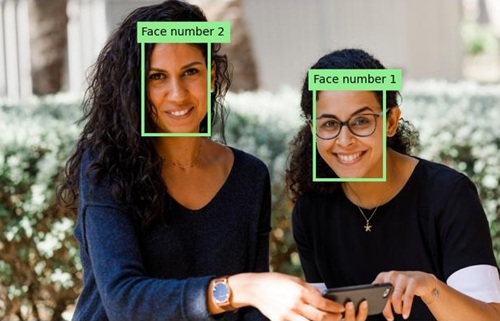

---
lab:
  title: 얼굴 감지 및 분석
  description: Azure AI 비전 얼굴 서비스를 사용하여 얼굴 감지 및 분석 솔루션을 구현합니다.
---

# 얼굴 감지 및 분석

사람의 얼굴을 감지 및 분석하는 기능은 AI의 핵심 기능입니다. 이 연습에서는 얼굴 관련 작업을 위한 **얼굴** 서비스를 살펴봅니다.

> **참고**: 이 연습은 사전 출시된 SDK 소프트웨어를 기반으로 하며, 변경될 수 있습니다. 필요한 경우 특정 버전의 패키지를 사용했으며, 이는 최신 버전이 반영되지 않을 수 있습니다. 예기치 않은 동작, 경고 또는 오류가 발생할 수 있습니다.

이 연습은 Azure 비전 얼굴 Python SDK를 기준으로 하지만 다음을 포함하여 여러 언어별 SDK를 사용하여 비전 애플리케이션을 개발할 수 있습니다. 다음과 같은 내용이 포함되어 있습니다.

* [JavaScript용 Azure AI 비전 얼굴](https://www.npmjs.com/package/@azure-rest/ai-vision-face)
* [Microsoft .NET용 Azure AI 비전 얼굴](https://www.nuget.org/packages/Azure.AI.Vision.Face)
* [Java용 Azure AI 비전 얼굴](https://central.sonatype.com/artifact/com.azure/azure-ai-vision-face)

이 연습에는 약 **30**분이 소요됩니다.

> **참고**: 개인 식별 정보를 반환하는 Azure AI 서비스의 기능은 [제한된 액세스 권한](https://learn.microsoft.com/legal/cognitive-services/computer-vision/limited-access-identity)이 부여된 고객으로 제한됩니다. 이 연습에는 얼굴 인식 작업이 포함되지 않으며 제한된 기능에 대한 추가 액세스를 요청하지 않고 완료할 수 있습니다.

## Azure AI 얼굴 API 리소스 프로비전

구독에 Azure AI 얼굴 API 리소스가 아직 없으면 프로비전해야 합니다.

> **참고**: 이 연습에서는 독립 실행형 **얼굴** 리소스를 사용합니다. 직접 또는 *Azure AI Foundry* 프로젝트에서 *Azure AI 서비스* 다중 서비스 리소스의 Azure AI 얼굴 서비스를 사용할 수도 있습니다.

1. `https://portal.azure.com`의 [Azure Portal](https://portal.azure.com)을 열고 Azure 자격 증명을 사용하여 로그인합니다. 표시되는 환영 메시지 또는 팁을 닫습니다.
1. **리소스 만들기**를 선택합니다.
1. 검색 창에서 검색하고 `Face`을 검색하고 **얼굴**을 선택하고, 다음 설정을 사용하여 리소스를 만듭니다.
    - **구독**: ‘Azure 구독’
    - **리소스 그룹**: ‘리소스 그룹 만들기 또는 선택’
    - **지역**: *사용 가능한 지역 선택*
    - **이름**: *얼굴 리소스의 유효한 이름*
    - 가격 책정 계층: 무료 F0

1. 리소스를 만들고 배포가 완료되기를 기다린 다음, 배포 세부 정보를 봅니다.
1. 리소스가 배포되면 리소스로 이동하고 탐색 창의 **리소스 관리** 노드 아래에서 해당 **키 및 엔드포인트** 페이지를 확인합니다. 다음 절차에서 이 페이지에 표시되는 키 중 하나와 엔드포인트가 필요합니다.

## 얼굴 SDK를 사용하여 얼굴 분석 앱 개발

이 연습에서는 Azure 얼굴 SDK를 사용하여 이미지에서 사람의 얼굴을 감지하고 분석하는 부분적으로 구현된 클라이언트 애플리케이션을 완료합니다.

### 애플리케이션 구성 준비

1. Azure Portal에서 페이지 상단의 검색 창 오른쪽에 있는 **[\>_]** 단추를 사용하여 Azure Portal에 새 Cloud Shell을 만들고 구독에 저장소가 없는 ***PowerShell*** 환경을 선택합니다.

    Cloud Shell은 Azure Portal 하단의 창에서 명령줄 인터페이스를 제공합니다.

    > **참고**: 이전에 *Bash* 환경을 사용하는 Cloud Shell을 만든 경우 ***PowerShell***로 전환합니다.

    > **참고**: 포털에서 파일을 보관할 스토리지를 선택하라는 메시지가 표시되면 **필요한 스토리지 계정 없음**을 선택하고 사용 중인 구독을 선택한 다음, **적용**을 누릅니다.

1. Cloud Shell 도구 모음의 **설정** 메뉴에서 **클래식 버전으로 이동**을 선택합니다(코드 편집기를 사용하는 데 필요).

    **<font color="red">계속하기 전에 Cloud Shell의 클래식 버전으로 전환했는지 확인합니다.</font>**

1. Face 리소스의 **키 및 엔드포인트** 페이지를 계속 볼 수 있도록 Cloud Shell 창의 크기를 조정합니다.

    > **팁**: 위쪽 테두리를 끌어 창의 크기를 조정할 수 있습니다. 최소화 및 최대화 단추를 사용하여 Cloud Shell과 기본 포털 인터페이스 사이를 전환할 수도 있습니다.

1. Cloud Shell 창에서 다음 명령을 입력하여 이 연습의 코드 파일이 포함된 GitHub 리포지토리를 복제합니다(명령을 입력하거나 클립보드에 복사한 다음 명령줄을 마우스 오른쪽 단추로 클릭하여 일반 텍스트로 붙여넣습니다).

    ```
    rm -r mslearn-ai-vision -f
    git clone https://github.com/MicrosoftLearning/mslearn-ai-vision
    ```

    > **팁**: CloudShell에 명령을 붙여넣으면 출력이 화면 버퍼의 많은 부분을 차지할 수 있습니다. `cls` 명령을 입력해 화면을 지우면 각 작업에 더 집중할 수 있습니다.

1. 리포지토리가 복제된 후 다음 명령을 사용하여 애플리케이션 코드 파일로 이동합니다.

    ```
   cd mslearn-ai-vision/Labfiles/face/python/face-api
   ls -a -l
    ```

    폴더에는 앱용 애플리케이션 구성 및 코드 파일이 포함되어 있습니다. 또한 앱에서 분석할 이미지 파일이 포함된 **/images** 하위 폴더도 포함되어 있습니다.

1. 다음 명령을 실행하여 Azure AI 비전 SDK 패키지 및 기타 필수 패키지를 설치합니다.

    ```
   python -m venv labenv
   ./labenv/bin/Activate.ps1
   pip install -r requirements.txt azure-ai-vision-face==1.0.0b2
    ```

1. 다음 명령을 입력하여 앱의 구성 파일을 편집합니다.

    ```
   code .env
    ```

    코드 편집기에서 파일이 열립니다.

1. 코드 파일에서 얼굴 리소스에 대한 **엔드포인트** 및 인증 **키**(Azure Portal의 **키 및 엔드포인트** 페이지에서 복사)를 반영하도록 해당 파일이 포함하는 구성 값을 업데이트합니다.
1. 자리 표시자를 바꾼 후 **Ctrl+S** 명령을 사용하여 변경 내용을 저장한 다음 **Ctrl+Q** 명령을 사용하여 Cloud Shell 명령줄을 열어 두고 코드 편집기를 닫습니다.

### 얼굴 API 클라이언트를 만들기 위한 코드 추가

1. Cloud Shell 명령줄에서 다음 명령을 입력하여 클라이언트 애플리케이션에 대한 코드 파일을 엽니다.

    ```
   code analyze-faces.py
    ```

    > **팁**: 코드를 더 쉽게 볼 수 있도록 Cloud Shell 창을 최대화하고 명령줄 콘솔과 코드 편집기 사이에서 분할 막대를 이동할 수 있습니다.

1. 코드 파일에서 **Import namespaces** 주석을 찾고 다음 코드를 추가하여 Azure AI 비전 SDK를 사용하는 데 필요한 네임스페이스를 가져옵니다.

    ```python
   # Import namespaces
   from azure.ai.vision.face import FaceClient
   from azure.ai.vision.face.models import FaceDetectionModel, FaceRecognitionModel, FaceAttributeTypeDetection01
   from azure.core.credentials import AzureKeyCredential
    ```

1. **Main** 함수에서 구성 설정을 로드하고 분석할 이미지를 확인하는 코드가 제공되었는지 확인합니다. 그런 다음, **Authenticate Face client** 주석을 찾고 다음 코드를 추가하여 **FaceClient** 개체를 만들고 인증합니다.

    ```python
   # Authenticate Face client
   face_client = FaceClient(
        endpoint=cog_endpoint,
        credential=AzureKeyCredential(cog_key))
    ```

### 얼굴을 감지하고 분석하기 위한 코드 추가

1. 애플리케이션의 코드 파일에 있는 **Main** 함수에서 **Specify facial features to be retrieved** 주석을 찾고 다음 코드를 추가합니다.

    ```python
   # Specify facial features to be retrieved
   features = [FaceAttributeTypeDetection01.HEAD_POSE,
                FaceAttributeTypeDetection01.OCCLUSION,
                FaceAttributeTypeDetection01.ACCESSORIES]
    ```

1. **Main** 함수의 방금 추가한 코드에서 **Get faces** 주석을 찾고 다음 코드를 추가하여 얼굴 특징 정보를 인쇄하고 각 얼굴의 **face_rectangle** 속성에 따라 감지된 각 얼굴의 경계 상자로 이미지에 주석을 추가하는 함수를 호출합니다.

    ```Python
   # Get faces
   with open(image_file, mode="rb") as image_data:
        detected_faces = face_client.detect(
            image_content=image_data.read(),
            detection_model=FaceDetectionModel.DETECTION01,
            recognition_model=FaceRecognitionModel.RECOGNITION01,
            return_face_id=False,
            return_face_attributes=features,
        )

   face_count = 0
   if len(detected_faces) > 0:
        print(len(detected_faces), 'faces detected.')
        for face in detected_faces:
    
            # Get face properties
            face_count += 1
            print('\nFace number {}'.format(face_count))
            print(' - Head Pose (Yaw): {}'.format(face.face_attributes.head_pose.yaw))
            print(' - Head Pose (Pitch): {}'.format(face.face_attributes.head_pose.pitch))
            print(' - Head Pose (Roll): {}'.format(face.face_attributes.head_pose.roll))
            print(' - Forehead occluded?: {}'.format(face.face_attributes.occlusion["foreheadOccluded"]))
            print(' - Eye occluded?: {}'.format(face.face_attributes.occlusion["eyeOccluded"]))
            print(' - Mouth occluded?: {}'.format(face.face_attributes.occlusion["mouthOccluded"]))
            print(' - Accessories:')
            for accessory in face.face_attributes.accessories:
                print('   - {}'.format(accessory.type))
            # Annotate faces in the image
            annotate_faces(image_file, detected_faces)
    ```

1. **Main** 함수에 추가한 코드를 검사합니다. 이미지 파일을 분석하고 머리 자세, 마스크 유무 및 안경과 같은 액세서리 유무 특성 등, 이미지 파일에 포함된 모든 얼굴을 감지합니다. 또한 감지된 각 얼굴에 대한 경계 상자를 사용하여 원래 이미지에 주석을 달기 위한 함수가 호출됩니다.
1. 변경 내용을 저장하고(*Ctrl+S*), 입력 오류를 수정해야 하는 경우에는 코드 편집기를 열어 둡니다.

1. 콘솔을 더 많이 볼 수 있도록 창의 크기를 조정하고, *images/face1.jpg* 인수와 함께 다음 명령을 입력하여 프로그램을 실행합니다.

    ```
   python analyze-faces.py images/face1.jpg
    ```

    앱은 다음 이미지를 실행하고 분석합니다.

    

1. 출력을 살펴봅니다. 출력에는 감지된 각 얼굴의 ID와 특성이 포함되어 있습니다. 
1. **detected_faces.jpg**라는 이미지 파일도 생성됩니다. (Azure Cloud Shell 관련) **download** 명령을 사용하여 다운로드합니다.

    ```
   download detected_faces.jpg
    ```

    다운로드 명령은 브라우저의 오른쪽 아래에 팝업 링크를 만듭니다. 이 링크를 선택하여 파일을 다운로드하고 열 수 있습니다. 이 이미지와 다음과 유사하게 표시됩니다.

    

1. 프로그램을 다시 실행합니다. 이번에는 *images/face2.jpg* 매개 변수를 지정하여 다음 이미지에서 텍스트를 추출합니다.

    

    ```
   python analyze-faces.py images/face2.jpg
    ```

1. 결과 **detected_faces.jpg** 파일을 다운로드하고 봅니다.

    ```
   download detected_faces.jpg
    ```

    결과 이미지는 다음과 같습니다.

    

1. 프로그램을 한 번 더 실행하는데, 이번에는 *images/faces.jpg* 매개 변수를 지정하여 이 이미지에서 텍스트를 추출합니다.

    

    ```
   python analyze-faces.py images/faces.jpg
    ```

1. 결과 **detected_faces.jpg** 파일을 다운로드하고 봅니다.

    ```
   download detected_faces.jpg
    ```

    결과 이미지는 다음과 같습니다.

    

## 리소스 정리

Azure AI 비전 탐색을 완료한 경우 불필요한 Azure 비용이 발생하지 않도록 이 연습에서 만든 리소스를 삭제해야 합니다.

1. `https://portal.azure.com`에서 Azure Portal을 열고 상단 검색 창에서 이 랩에서 만든 리소스를 검색합니다.

1. 리소스 페이지에서 **삭제**를 선택하고 지침에 따라 리소스를 삭제합니다. 또는 전체 리소스 그룹을 삭제하여 모든 리소스를 동시에 정리할 수 있습니다.
