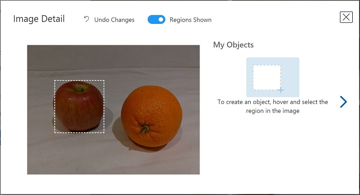
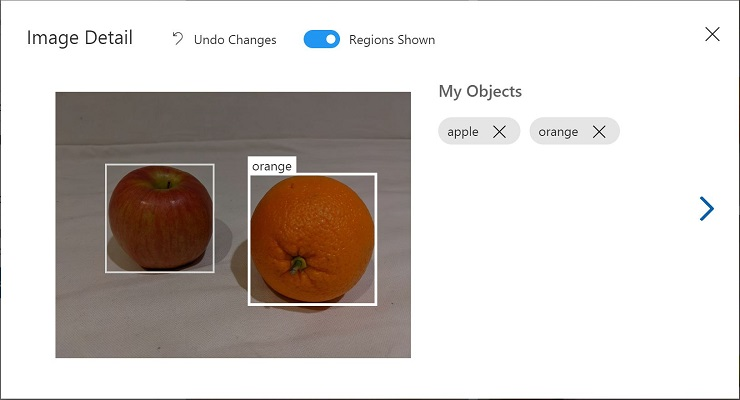

---
lab:
  title: 이미지에서 개체 검색
  description: Azure AI Custom Vision 서비스를 사용하여 개체 감지 모델을 학습시킵니다.
---

# 이미지에서 개체 검색

**Custom Vision** 서비스에서는 사용자 고유의 이미지로 학습되는 Computer Vision 모델을 만들 수 있습니다. 이 서비스를 사용하여 *이미지 분류* 및 *개체 감지* 모델을 학습시킨 다음 게시하여 애플리케이션에서 사용할 수 있습니다.

이 연습에서는 Custom Vision 서비스를 사용하여 이미지에서 3가지 과일 클래스(사과, 바나나, 오렌지)을 감지하고 찾을 수 있는 *개체 감지* 모델을 학습시킵니다.

이 연습은 Azure Custom Vision Python SDK를 기준으로 하지만 다음을 포함하여 여러 언어별 SDK를 사용하여 비전 애플리케이션을 개발할 수 있습니다. 다음과 같은 내용이 포함되어 있습니다.

* [JavaScript용 Azure Custom Vision(학습)](https://www.npmjs.com/package/@azure/cognitiveservices-customvision-training)
* [JavaScript용 Azure Custom Vision(예측)](https://www.npmjs.com/package/@azure/cognitiveservices-customvision-prediction)
* [Microsoft .NET용 Azure Custom Vision(학습)](https://www.nuget.org/packages/Microsoft.Azure.CognitiveServices.Vision.CustomVision.Training/)
* [Microsoft .NET용 Azure Custom Vision(예측)](https://www.nuget.org/packages/Microsoft.Azure.CognitiveServices.Vision.CustomVision.Prediction/)
* [Java용 Azure Custom Vision(학습)](https://search.maven.org/artifact/com.azure/azure-cognitiveservices-customvision-training/1.1.0-preview.2/jar)
* [Java용 Azure Custom Vision(예측)](https://search.maven.org/artifact/com.azure/azure-cognitiveservices-customvision-prediction/1.1.0-preview.2/jar)

이 연습에는 약 **45**분이 소요됩니다.

## Custom Vision 리소스 만들기

모델을 학습시키려면 *학습* 및 *예측*용 Azure 리소스가 필요합니다. 이러한 각 작업용으로 **Custom Vision** 리소스를 만들 수도 있고, 리소스 하나를 만든 다음, 두 작업에 사용할 수도 있습니다. 이 연습에서는 학습 및 예측을 위한 **Custom Vision** 리소스를 만듭니다.

1. `https://portal.azure.com`의 [Azure Portal](https://portal.azure.com)을 열고 Azure 자격 증명을 사용하여 로그인합니다. 표시되는 환영 메시지 또는 팁을 닫습니다.
1. **리소스 만들기**를 선택합니다.
1. 검색 창에서 검색하고 `Custom Vision`을 검색하고 **Custom Vision**을 선택하고, 다음 설정을 사용하여 리소스를 만듭니다.
    - **만들기 옵션**: 모두
    - **구독**: ‘Azure 구독’
    - **리소스 그룹**: ‘리소스 그룹 만들기 또는 선택’
    - **지역**: *사용 가능한 지역 선택*
    - **이름**: *Custom Vision 리소스의 유효한 이름*
    - **학습 가격 책정 계층**: F0
    - **예측 가격 책정 계층**: F0

1. 리소스를 만들고 배포가 완료되기를 기다린 다음, 배포 세부 정보를 봅니다. 두 개의 Custom Vision 리소스가 프로비전됩니다. 하나는 학습용이고 다른 하나는 예측용입니다.

    > **참고**: 각 리소스에는 자체 *엔드포인트* 및 *키*가 있습니다. 엔드포인트와 키는 코드에서 액세스를 관리하는 데 사용됩니다. 이미지 분류 모델을 학습시키려면 코드가 *학습* 리소스(해당 엔드포인트와 키 포함)를 사용해야 합니다. 그리고 학습된 모델을 사용하여 이미지 클래스를 예측하려면 코드가 *예측* 리소스(해당 엔드포인트와 키 포함)를 사용해야 합니다.

1. 리소스가 배포되면 리소스 그룹으로 이동하여 해당 리소스를 확인합니다. 두 개의 Custom Vision 리소스가 표시되는데, 하나에는 접미사 ***-Prediction***이 붙어 있습니다.

## Custom Vision 포털에서 Custom Vision 프로젝트 만들기

개체 감지 모델을 학습시키려면 학습 리소스에 따라 Custom Vision 프로젝트를 만들어야 합니다. 이렇게 하려면 Custom Vision 포털을 사용합니다.

1. 새 브라우저 탭을 엽니다(나중에 돌아갈 예정이므로 Azure Portal 탭 열어 두기).
1. 새 브라우저 탭에서 `https://customvision.ai`의 [Custom Vision 포털](https://customvision.ai)을 엽니다. 로그인하라는 메시지가 표시되면 Azure 자격 증명을 사용하여 로그인하고 서비스 약관에 동의합니다.
1. 다음 설정을 사용하여 새 프로젝트를 만듭니다.
    - **이름**: `Detect Fruit`
    - **설명**: `Object detection for fruit.`
    - **리소스**: *Custom Vision 리소스*
    - **프로젝트 형식**: 개체 감지
    - **도메인**: 일반
1. 프로젝트가 만들어지고 브라우저에서 열릴 때까지 기다립니다.

## 이미지 업로드 및 태그 지정

이제 개체 검색 프로젝트가 만들어졌으므로 이미지를 업로드하고 태그를 지정하여 모델을 학습시킬 수 있습니다.

### Custom Vision 포털에서 이미지 업로드 및 태그 지정

Custom Vision 포털에는 이미지를 업로드하고 여러 유형의 개체가 포함된 영역에 태그를 지정하는 데 사용할 수 있는 시각적 도구가 포함되어 있습니다.

1. 새 브라우저 탭에서 `https://github.com/MicrosoftLearning/mslearn-ai-vision/raw/main/Labfiles/object-detection/training-images.zip`의 [학습 이미지](https://github.com/MicrosoftLearning/mslearn-ai-vision/raw/main/Labfiles/object-detection/training-images.zip)를 다운로드하고 zip 폴더의 압축을 풀어 콘텐츠를 봅니다. 이 폴더에는 과일 이미지가 포함되어 있습니다.
1. Custom Vision Portal의 개체 감지 프로젝트에서 **이미지 추가**를 클릭하고 압축 해제된 폴더 안의 모든 이미지를 업로드합니다.
1. 이미지를 업로드한 후 첫 번째 이미지를 선택하여 엽니다.
1. 자동으로 감지된 영역이 아래 이미지와 같이 표시될 때까지 이미지의 개체 위에 마우스를 놓고 있습니다. 그런 다음, 개체를 선택하고 필요한 경우 영역의 크기를 조정하여 개체를 둘러싸도록 합니다.

    

    또는 단순히 개체를 주변을 끌어 영역을 만들 수 있습니다.

1. 영역이 개체를 둘러싸는 경우 다음과 같이 적절한 개체 유형(*apple*, *banana* 또는 *orange*)의 새 태그를 추가합니다.

    

1. 이미지에서 서로 다른 개체를 선택하고 태그를 지정하여 영역 크기를 조정하고 필요에 따라 새 태그를 추가합니다.

    

1. 오른쪽의 **>** 링크를 사용하여 다음 이미지로 이동하고 해당 개체에 태그를 지정합니다. 그런 다음, 전체 이미지 컬렉션으로 계속 작업하고 각각에 apple, apple 및 orange 태그를 지정합니다.

1. 마지막 이미지에 태그를 지정했으면 **이미지 세부 정보** 편집기를 닫습니다. **학습 이미지** 페이지의 **태그** 아래에서 **태그가 지정됨**을 선택하여 태그가 지정된 모든 이미지를 확인합니다.


### Custom Vision SDK를 사용하여 이미지 업로드

Custom Vision 포털의 UI를 사용하여 이미지에 태그를 지정할 수도 있지만, 대다수 AI 개발 팀은 이미지의 태그 및 개체 영역 정보가 포함된 파일을 생성하는 다른 도구를 사용합니다. 이러한 시나리오에서는 Custom Vision 교육 API를 사용하여 프로젝트에 태그가 지정된 이미지를 업로드할 수 있습니다.

1. Custom Vision 포털의 **학습 이미지** 페이지 오른쪽 위에 있는 *설정*(&#9881;) 아이콘을 클릭하여 프로젝트 설정을 표시합니다.
1. **일반**(왼쪽에 있음) 아래에서 이 프로젝트를 고유하게 식별하는 **프로젝트 ID**를 확인합니다.
1. 오른쪽의 **리소스** 아래에 **키** 및 **엔드포인트**가 표시됩니다. 학습 리소스에 대한 세부 정보입니다(Azure Portal에서 리소스를 확인하여 이 정보를 얻을 수도 있음).**
1. Azure Portal이 포함된 브라우저 탭으로 돌아갑니다(나중에 돌아갈 예정이므로 Custom Vision 포털 탭 열어 두기).
1. Azure Portal에서 페이지 상단의 검색 창 오른쪽에 있는 **[\>_]** 단추를 사용하여 Azure Portal에 새 Cloud Shell을 만들고 구독에 저장소가 없는 ***PowerShell*** 환경을 선택합니다.

    Cloud Shell은 Azure Portal 하단의 창에서 명령줄 인터페이스를 제공합니다.

    > **참고**: 이전에 *Bash* 환경을 사용하는 Cloud Shell을 만든 경우 ***PowerShell***로 전환합니다.

    > **참고**: 포털에서 파일을 보관할 스토리지를 선택하라는 메시지가 표시되면 **필요한 스토리지 계정 없음**을 선택하고 사용 중인 구독을 선택한 다음, **적용**을 누릅니다.

1. Cloud Shell 도구 모음의 **설정** 메뉴에서 **클래식 버전으로 이동**을 선택합니다(코드 편집기를 사용하는 데 필요).

    **<font color="red">계속하기 전에 Cloud Shell의 클래식 버전으로 전환했는지 확인합니다.</font>**

1. 더 많은 내용을 볼 수 있도록 Cloud Shell 창의 크기를 조정합니다.

    > **팁**: 위쪽 테두리를 끌어 창의 크기를 조정할 수 있습니다. 최소화 및 최대화 단추를 사용하여 Cloud Shell과 기본 포털 인터페이스 사이를 전환할 수도 있습니다.

1. Cloud Shell 창에서 다음 명령을 입력하여 이 연습의 코드 파일이 포함된 GitHub 리포지토리를 복제합니다(명령을 입력하거나 클립보드에 복사한 다음 명령줄을 마우스 오른쪽 단추로 클릭하여 일반 텍스트로 붙여넣습니다).

    ```
    rm -r mslearn-ai-vision -f
    git clone https://github.com/MicrosoftLearning/mslearn-ai-vision
    ```

    > **팁**: CloudShell에 명령을 붙여넣을 때, 출력이 화면 버퍼의 많은 부분을 차지할 수 있습니다. `cls` 명령을 입력해 화면을 지우면 각 작업에 더 집중할 수 있습니다.

1. 리포지토리가 복제된 후 다음 명령을 사용하여 애플리케이션 코드 파일로 이동합니다.

    ```
   cd mslearn-ai-vision/Labfiles/object-detection/python/train-detector
   ls -a -l
    ```

    폴더에는 앱용 애플리케이션 구성 및 코드 파일이 포함되어 있습니다. 또한 여러 이미지의 개체에 대한 경계 상자 좌표가 포함된 **tagged-images.json** 파일과 이미지를 포함하는 **/images** 하위 폴더가 포함되어 있습니다.

1. 다음 명령을 실행하여 학습 및 기타 필수 패키지용 Azure AI Custom Vision SDK 패키지를 설치합니다.

    ```
   python -m venv labenv
   ./labenv/bin/Activate.ps1
   pip install -r requirements.txt azure-cognitiveservices-vision-customvision
    ```

1. 다음 명령을 입력하여 앱의 구성 파일을 편집합니다.

    ```
   code .env
    ```

    코드 편집기에서 파일이 열립니다.

1. 코드 파일에서 Custom Vision *학습* 리소스의 **엔드포인트** 및 인증 **키**, 그리고 이전에 만든 Custom Vision 프로젝트의 **프로젝트 ID**를 반영하도록 해당 파일에 포함된 구성 값을 업데이트합니다.
1. 자리 표시자를 바꾼 후 코드 편집기에서 **CTRL+S** 명령을 사용하여 변경 내용을 저장한 다음 **CTRL+Q** 명령을 사용하여 Cloud Shell 명령줄을 열어둔 채 코드 편집기를 닫습니다.
1. cloud shell 명령줄에서 다음 명령을 입력하여 **tagged-images.json** 파일을 열고 **/images** 하위 폴더의 이미지 파일에 대한 태그 지정 정보를 확인합니다.

    ```
   code tagged-images.json
    ```
    
     JSON은 태그가 지정된 영역이 하나 이상 포함된 이미지 목록을 정의합니다. 태그가 지정된 각 영역에는 태그 이름, 그리고 태그가 지정된 개체가 들어 있는 경계 상자의 위쪽 및 왼쪽 좌표와 너비 및 높이 치수가 포함되어 있습니다.

    > **참고**: 이 파일의 좌표 및 치수는 이미지의 상대 지점을 나타냅니다. 예를 들어 *높이* 값이 0.7이면 상자 위치가 이미지 높이의 70%라는 의미입니다. 다른 파일 형식을 생성하는 태그 지정 도구도 있습니다. 가령 좌표 및 치수 값이 픽셀, 인치 또는 기타 측정 단위를 나타낼 수도 있습니다.

1. 변경 내용을 저장하지 않고 JSON 파일을 닫습니다(*CTRL_Q*).

1. Cloud Shell 명령줄에서 다음 명령을 입력하여 클라이언트 애플리케이션에 대한 코드 파일을 엽니다.

    ```
   code add-tagged-images.py
    ```

1. 코드 파일에서 다음 세부 정보를 확인합니다.
    - Azure AI Custom Vision SDK의 네임스페이스를 가져왔는지 확인합니다.
    - **Main** 함수가 구성 설정을 검색하며 키와 엔드포인트를 사용하여 인증된 **CustomVisionTrainingClient**를 만듭니다. 이 CustomVisionTrainingClient와 프로젝트 ID를 사용하여 프로젝트에 대한 **Project** 참조를 만듭니다.
    - **Upload_Images** 함수가 JSON 파일에서 태그가 지정된 영역 정보를 추출하고, 해당 정보를 사용하여 영역이 포함된 이미지 배치를 만든 후 프로젝트에 해당 배치를 업로드합니다.

1. 코드 편집기를 닫고(*Ctrl+Q*) 다음 명령을 입력하여 프로그램을 실행합니다.

    ```
   python add-tagged-images.py
    ```

1. 프로그램이 종료될 때까지 기다립니다.
1. Custom Vision 포털이 포함된 브라우저 탭으로 다시 돌아와(Azure Portal Cloud Shell 탭 열어 두기) 프로젝트의 **학습 이미지** 페이지를 봅니다(필요한 경우 브라우저 새로 고침).
1. 새로 태그가 지정된 이미지 몇 개가 프로젝트에 추가되었음을 확인합니다.

## 모델 학습 및 테스트

프로젝트의 이미지에 태그를 지정했으므로 이제 모델을 학습시킬 준비가 되었습니다.

1. Custom Vision 프로젝트에서 **학습**(&#9881;<sub>&#9881;</sub>)을 클릭하여 태그가 지정된 이미지로 개체 감지 모델을 학습시킵니다. **빠른 학습** 옵션을 선택합니다.
1. 학습이 완료될 때까지 기다립니다(10분 정도 걸릴 수 있음).

    > **팁**: Azure Cloud Shell은 20분 넘게 활동이 없으면 세션이 중단됩니다. 학습이 완료될 때까지 기다리는 동안 가끔씩 Cloud Shell로 돌아가 `ls`와 같은 명령을 입력하면 세션을 활성 상태로 유지할 수 있습니다.

1. Custom Vision 포털에서 학습이 완료되면 *정밀도*, *재현율* 및 *mAP*를 검토합니다. 이러한 메트릭은 개체 검색 모델의 예측 정확도를 측정하며 해당 값은 모두 높아야 합니다.
1. 페이지 오른쪽 위에서 **빠른 테스트**를 클릭한 다음, **이미지 URL** 상자에 `https://aka.ms/test-fruit`를 입력하고 *빠른 테스트 이미지*(&#10132;) 단추를 클릭합니다.
1. 생성된 예측을 봅니다.

    

1. **빠른 테스트** 창을 닫습니다.

## 클라이언트 애플리케이션에서 개체 감지기 사용

이제 학습시킨 모델을 게시하고 클라이언트 애플리케이션에서 사용할 준비가 되었습니다.

### 개체 감지 모델 게시

1. Custom Vision 포털의 **성능** 페이지에서 **&#128504; 게시**를 클릭하여 다음 설정을 사용해 학습시킨 모델을 게시합니다.
    - **모델 이름**: `fruit-detector`
    - **예측 리소스**: 이전에 만든 **예측** “-Prediction”으로 끝나는 리소스(학습 리소스 <u>아님</u>)**
1. **프로젝트 설정** 페이지 왼쪽 위에서 *프로젝트 설정*(&#128065;) 아이콘을 클릭하여 Custom Vision 포털 홈 페이지로 돌아옵니다. 이제 홈 페이지에 프로젝트가 나열됩니다.
1. Custom Vision 포털 홈 페이지 오른쪽 위의 *설정*(&#9881;) 아이콘을 클릭하여 Custom Vision 서비스의 설정을 확인합니다. 그런 다음 **리소스** 아래에서 “-Prediction”으로 끝나는 예측 리소스(학습 리소스 <u>아님</u>)를 찾아 **키** 및 **엔드포인트** 값을 확인합니다(Azure Portal에서 리소스를 표시해도 이 정보를 확인할 수 있음).**

## 클라이언트 애플리케이션에서 이미지 분류자 사용

이미지 분류 모델을 게시했으므로 클라이언트 애플리케이션에서 해당 모델을 사용할 수 있습니다. 이번에도 **C#** 또는 **Python** 사용을 선택할 수 있습니다.

1. Azure Portal과 Cloud Shell 창이 포함된 브라우저 탭으로 돌아갑니다.
1. Cloud Shell에서 다음 명령을 실행하여 클라이언트 애플리케이션에 대한 폴더로 전환하고 포함된 파일을 봅니다.

    ```
   cd ../test-detector
   ls -a -l
    ```

    폴더에는 앱용 애플리케이션 구성 및 코드 파일이 포함되어 있습니다. 또한 모델을 테스트하는 데 사용할 다음 **produce.jpg** 이미지 파일이 포함되어 있습니다.

    

1. 다음 명령을 실행하여 예측 및 기타 필수 패키지용 Azure AI Custom Vision SDK 패키지를 설치합니다.

    ```
   python -m venv labenv
   ./labenv/bin/Activate.ps1
   pip install -r requirements.txt azure-cognitiveservices-vision-customvision
    ```

1. 다음 명령을 입력하여 앱의 구성 파일을 편집합니다.

    ```
   code .env
    ```

    코드 편집기에서 파일이 열립니다.

1. Custom Vision *<u>예측</u>* 리소스의 **엔드포인트** 및 **키**, 개체 감지 프로젝트의 **프로젝트 ID** 및 게시된 모델의 이름(*fruit-detector*)을 반영하도록 구성 값을 업데이트합니다. 변경 내용을 저장하고(*CTRL+S*), 코드 편집기를 닫습니다(*CTRL+Q*).

1. Cloud Shell 명령줄에서 다음 명령을 입력하여 클라이언트 애플리케이션에 대한 코드 파일을 엽니다.

    ```
   code test-detector.py
    ```

1. 코드를 검토하고 다음 세부 사항을 확인합니다.
    - Azure AI Custom Vision SDK의 네임스페이스를 가져왔는지 확인합니다.
    - **Main** 함수가 구성 설정을 검색하며 키와 엔드포인트를 사용하여 인증된 **CustomVisionPredictionClient**를 만듭니다.
    - 예측 클라이언트 개체를 사용하여 요청에서 프로젝트 ID와 모델 이름을 지정해 **produce.jpg** 이미지에 대한 개체 감지 예측을 가져옵니다. 이미지에서 예측된 태그 지정 영역을 그리고 결과를 **output.jpg**로 저장합니다.
1. 코드 편집기를 닫고 다음 명령을 입력하여 프로그램을 실행합니다.

    ```
   python test-detector.py
    ```

1. 프로그램 출력을 검토합니다. 출력에는 이미지에서 감지된 각 개체가 나열됩니다.
1. **output.jpg**라는 이미지 파일이 생성됩니다. (Azure Cloud Shell 관련) **download** 명령을 사용하여 다운로드합니다.

    ```
   download output.jpg
    ```

    다운로드 명령은 브라우저의 오른쪽 아래에 팝업 링크를 만듭니다. 이 링크를 선택하여 파일을 다운로드하고 열 수 있습니다. 이 이미지와 다음과 유사하게 표시됩니다.

    

## 리소스 정리

다른 학습 모듈을 위해 이 랩에서 만들어진 Azure 리소스를 사용하지 않는 경우 해당 리소스를 삭제하여 추가 요금이 발생하지 않도록 할 수 있습니다.

1. `https://portal.azure.com`에서 Azure Portal을 열고 상단 검색 창에서 이 랩에서 만든 리소스를 검색합니다.

1. 리소스 페이지에서 **삭제**를 선택하고 지침에 따라 리소스를 삭제합니다. 또는 전체 리소스 그룹을 삭제하여 모든 리소스를 동시에 정리할 수 있습니다.
   
## 자세한 정보

Custom Vision 서비스를 통한 개체 감지에 대한 자세한 내용은 [Custom Vision 설명서](https://docs.microsoft.com/azure/cognitive-services/custom-vision-service/)를 참조하세요.
