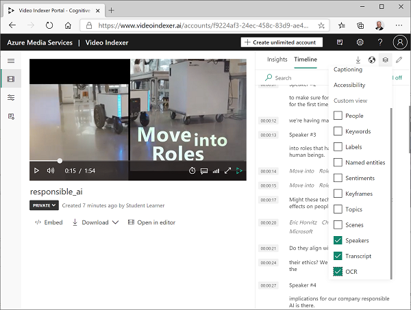

---
lab:
  title: 비디오 분석
  description: Azure AI Video Indexer를 사용하여 비디오를 분석합니다.
---

# 비디오 분석

오늘날 생성 및 사용되고 있는 데이터 중 대부분은 비디오 형식입니다. **Video Indexer**는 비디오를 인덱싱하고 비디오에서 인사이트를 추출하는 데 사용할 수 있는 AI 지원 서비스입니다.

> **참고**: 2022년 6월 21일부터 개인 식별 정보를 반환하는 Azure AI 서비스 기능은 [제한된 액세스 권한](https://docs.microsoft.com/azure/cognitive-services/cognitive-services-limited-access)이 부여된 고객으로 제한됩니다. 제한된 액세스 승인을 받지 않으면 이 랩에서 Video Indexer로 사용자 및 유명인사를 인식하는 기능을 사용할 수 없습니다. Microsoft가 변경한 내용 및 그 이유에 대한 자세한 내용은 [얼굴 인식에 대한 책임 있는 AI 투자 및 보호 조치](https://azure.microsoft.com/blog/responsible-ai-investments-and-safeguards-for-facial-recognition/)를 참조하세요.

## Video Indexer에 비디오 업로드

먼저 Video Indexer 포털에 로그인하여 비디오를 업로드해야 합니다.

1. 브라우저에서 `https://www.videoindexer.ai`의 [Video Indexer 포털](https://www.videoindexer.ai)을 엽니다.
1. 기존 Video Indexer 계정이 있는 경우 로그인합니다. 그렇지 않으면 무료 계정에 등록하고 Microsoft 계정(또는 다른 유효한 계정 유형)을 사용하여 로그인합니다. 로그인 과정에서 문제가 발생하면 프라이빗 브라우저 세션을 열어 보세요.

    > 참고: 처음 로그인하는 경우 서비스를 사용하는 방법을 확인하라는 팝업 양식이 표시될 수 있습니다. 

1. 새 탭에서 `https://aka.ms/responsible-ai-video`을(를) 방문하여 책임 있는 AI 비디오를 다운로드합니다. 파일을 저장합니다.
1. Video Indexer에서 **업로드** 옵션을 선택합니다. 그런 다음 **파일 찾아보기** 옵션을 선택하고 다운로드한 비디오를 선택한 다음 **추가**를 클릭합니다. **파일 이름** 필드의 텍스트를 **책임 있는 AI**로 변경합니다. **검토 + 업로드**를 선택하고, 요약 개요를 검토하고, 확인란을 선택하여 얼굴 인식에 대한 Microsoft 정책을 준수하는지 확인하고, 파일을 업로드합니다.
1. 파일이 업로드되면 Video Indexer에서 파일을 자동으로 인덱싱하는 동안 잠시 기다립니다.

> **참고**: 이 연습에서는 이 비디오를 사용해 Video Indexer 기능을 살펴봅니다. 이 비디오에는 AI 지원 애플리케이션을 책임감 있는 방식으로 개발하는 방법과 관련된 유용한 정보 및 지침이 포함되어 있으므로, 연습을 마친 후 비디오를 끝까지 시청해야 합니다. 

## 비디오 인사이트 검토

인덱싱 프로세스에서는 비디오의 인사이트가 추출됩니다. 추출된 인사이트는 포털에서 확인할 수 있습니다.

1. 비디오가 인덱싱되면 Video Indexer 포털에서 비디오를 선택하여 표시합니다. 비디오에서 추출된 인사이트가 표시되는 창 옆에 비디오 플레이어가 있습니다.

    > **참고**: 개별 ID 보호를 위한 제한된 액세스 정책으로 인해 비디오를 인덱싱할 때 이름이 표시되지 않을 수 있습니다.

    

1. 비디오가 재생되면 **타임라인** 탭을 선택하여 비디오 오디오의 대본을 확인합니다.

    

1. 포털 오른쪽 위에서 **보기** 기호(&#128455;와 유사)를 선택하고 인사이트 목록에서 **대본**과 더불어 **OCR**과 **발표자**를 선택합니다.

    

1. 이제 **타임라인** 창에 다음 항목이 포함됩니다.
    - 오디오 내레이션 대본
    - 비디오에 표시되는 텍스트
    - 비디오에 나오는 발표자 표시 잘 알려진 사람은 이름으로 자동 인식되며, 그 외의 사람은 숫자(예: 발표자 1번)로 표시됩니다.**
1. **인사이트** 창으로 다시 전환한 다음, 그곳에 표시되는 인사이트를 확인합니다. 다음이 포함됩니다.
    - 비디오에 나오는 각 사람
    - 비디오에서 논의하는 토픽
    - 비디오에 나오는 물체의 레이블
    - 비디오에 나오는 사람, 브랜드 등의 명명된 엔터티
    - 주요 장면
1. **인사이트** 창을 표시한 상태로 **보기** 기호를 다시 선택하고 인사이트 목록에서 **키워드**와 **감정**을 창에 추가합니다.

    여기서 확인되는 인사이트를 통해 비디오의 기본 주제를 파악할 수 있습니다. 예를 들어 이 비디오의 **토픽**은 기술, 사회적 책임, 윤리에 관한 것임을 명백하게 알 수 있습니다.

## 인사이트 검색

Video Indexer를 사용해 비디오에서 인사이트를 검색할 수 있습니다.

1. **인사이트** 창의 **검색** 상자에 *Bee*를 입력합니다. 모든 인사이트 유형의 결과를 확인하려면 인사이트 창을 아래쪽으로 스크롤해야 할 수 있습니다.
1. 일치 *레이블* 1개가 검색되며, 비디오에서 해당 레이블의 위치가 결과 아래에 표시됩니다.
1. Bee(벌)가 나오는 섹션 시작 부분을 선택하고 해당 시점부터 비디오를 시청합니다(벌은 아주 잠깐만 나오므로 비디오를 일시 중지하고 시작 부분을 정확하게 선택해야 할 수 있음).

    

1. **검색** 상자의 내용을 지워 비디오의 모든 인사이트가 표시되게 합니다.

## Video Indexer REST API 사용

Video Indexer는 계정에서 비디오를 업로드하고 관리하는 데 사용할 수 있는 REST API를 제공합니다.

1. 새 브라우저 탭에서 `https://portal.azure.com`의 [Azure Portal](https://portal.azure.com)을 열고 Azure 자격 증명을 사용하여 로그인합니다. Video Indexer 포털을 열어 둔 상태로 기존 탭을 유지합니다.
1. Azure Portal에서 페이지 상단의 검색 창 오른쪽에 있는 **[\>_]** 단추를 사용하여 Azure Portal에 새 Cloud Shell을 만들고 구독에 저장소가 없는 ***PowerShell*** 환경을 선택합니다.

    Cloud Shell은 Azure Portal 하단의 창에서 명령줄 인터페이스를 제공합니다.

    > **참고**: 이전에 *Bash* 환경을 사용하는 Cloud Shell을 만든 경우 ***PowerShell***로 전환합니다.

    > **참고**: 포털에서 파일을 보관할 스토리지를 선택하라는 메시지가 표시되면 **필요한 스토리지 계정 없음**을 선택하고 사용 중인 구독을 선택한 다음, **적용**을 누릅니다.

1. Cloud Shell 도구 모음의 **설정** 메뉴에서 **클래식 버전으로 이동**을 선택합니다(코드 편집기를 사용하는 데 필요).

    **<font color="red">계속하기 전에 Cloud Shell의 클래식 버전으로 전환했는지 확인합니다.</font>**

1. 더 많은 내용을 볼 수 있도록 Cloud Shell 창의 크기를 조정합니다.

    > **팁**: 위쪽 테두리를 끌어 창의 크기를 조정할 수 있습니다. 최소화 및 최대화 단추를 사용하여 Cloud Shell과 기본 포털 인터페이스 사이를 전환할 수도 있습니다.

1. Cloud Shell 창에서 다음 명령을 입력하여 이 연습의 코드 파일이 포함된 GitHub 리포지토리를 복제합니다(명령을 입력하거나 클립보드에 복사한 다음 명령줄을 마우스 오른쪽 단추로 클릭하여 일반 텍스트로 붙여넣습니다).

    ```
    rm -r mslearn-ai-vision -f
    git clone https://github.com/MicrosoftLearning/mslearn-ai-vision
    ```

    > **팁**: CloudShell에 명령을 붙여넣을 때, 출력이 화면 버퍼의 많은 부분을 차지할 수 있습니다. `cls` 명령을 입력해 화면을 지우면 각 작업에 더 집중할 수 있습니다.

1. 리포지토리가 복제된 후 이 연습에 대한 애플리케이션 코드 파일이 포함된 폴더로 이동합니다.  

    ```
   cd mslearn-ai-vision/Labfiles/video-indexer
    ```

### API 세부 정보 가져오기

Video Indexer API를 사용하려면 요청 인증을 위한 몇 가지 정보가 필요합니다.

1. Video Indexer 포털에서 왼쪽 창을 확장하고 **계정 설정** 페이지를 선택합니다.
1. 나중에 필요하므로 이 페이지의 **계정 ID**를 적어 둡니다.
1. 새 브라우저 탭을 열고 https://api-portal.videoindexer.ai의 [Video Indexer 개발자 포털](https://api-portal.videoindexer.ai)로 이동한 후 Azure 자격 증명을 사용하여 서명합니다.
1. **프로필** 페이지에서 프로필과 연관된 **구독**을 봅니다.
1. 구독이 표시된 페이지에서 각 구독에 키 2개(기본 키와 보조 키)가 할당되었음을 확인합니다. 그런 다음 두 키 중 하나에서 **표시**를 선택하여 키를 확인합니다. 잠시 후에 이 키가 필요합니다.

### REST API 사용

계정 ID와 API 키를 확인했으므로 REST API를 사용하여 계정에서 비디오 관련 작업을 할 수 있습니다. 이 절차에서는 PowerShell 스크립트를 사용하여 REST 호출을 수행합니다. 하지만 cURL, Postman 등의 HTTP 유틸리티나 HTTP를 통해 JSON을 보내고 받을 수 있는 모든 프로그래밍 언어에도 같은 원칙이 적용됩니다.

Video Indexer REST API와의 모든 상호 작용에서는 동일한 패턴이 사용됩니다.

- 헤더에서 API 키를 사용하는 **AccessToken** 메서드에 대한 초기 요청은 액세스 토큰을 가져오는 데 사용됩니다.
- 후속 요청에서는 비디오 작업을 위해 REST 메서드를 호출할 때 이 액세스 토큰을 사용해 인증을 합니다.

1. Cloud Shell에서 다음 명령을 사용하여 PowerShell 스크립트를 엽니다.

    ```
   code get-videos.ps1
    ```
    
1. PowerShell 스크립트에서 **YOUR_ACCOUNT_ID** 및 **YOUR_API_KEY**의 자리 표시자를 앞에서 확인한 계정 ID 및 API 키 값으로 바꿉니다.
1. 무료 계정의 *위치*는 "trial"입니다. 무제한 Video Indexer 계정(Azure 리소스가 연결되어 있음)을 만든 경우 이 값을 Azure 리소스가 프로비전된 위치(예: "eastus")로 변경할 수 있습니다.
1. 스크립트의 코드를 검토합니다. 코드에서는 REST 메서드 2개가 호출됩니다. 하나는 액세스 토큰을 가져오는 메서드이고, 다른 하나는 계정에 비디오를 나열하는 메서드입니다.
1. 변경 내용을 저장하고(*CTRL+S* 누르기), 코드 편집기를 닫고(*CTRL+Q* 누르기), 다음 명령을 실행하여 스크립트를 실행합니다.

    ```
   ./get-videos.ps1
    ```
    
1. REST 서비스의 JSON 응답을 확인합니다. 앞에서 인덱싱한 **책임 있는 AI** 비디오의 세부 정보가 응답에 포함되어 있습니다.

## Video Indexer 위젯 사용

Video Indexer 포털은 비디오 인덱싱 프로젝트를 관리할 수 있는 유용한 인터페이스입니다. 그러나 Video Indexer 계정 액세스 권한이 없는 사용자에게 비디오와 인사이트를 제공해야 하는 경우도 많습니다. Video Indexer에서는 이러한 용도로 웹 페이지에 포함할 수 있는 위젯을 제공합니다.

1. `ls` 명령을 사용하여 **video-indexer** 폴더의 내용을 확인합니다. **analyze-video.html** 파일이 포함되어 있음을 확인합니다. 이 기본 HTML 페이지를 Video Indexer **플레이어** 및 **인사이트** 위젯에 추가합니다.
1. 다음 명령을 입력하여 파일을 편집합니다.

    ```
   code analyze-video.html
    ```

    코드 편집기에서 파일이 열립니다.
   
1. 이 파일의 헤더에는 **vb.widgets.mediator.js** 스크립트 참조가 있습니다. 이 스크립트를 실행하면 페이지의 여러 Video Indexer 위젯이 서로 상호 작용할 수 있습니다.
1. Video Indexer 포털에서 **미디어 파일** 페이지로 돌아와 **Responsible AI** 비디오를 엽니다.
1. 비디오 플레이어 아래에서 **&lt;/&gt; 포함**을 선택하여 위젯을 포함할 HTML iframe 코드를 표시합니다.
1. **공유 및 포함** 대화 상자에서 **플레이어** 위젯을 선택하고 비디오 크기를 560 x 315로 설정한 다음 클립보드에 embed 태그를 복사합니다.
1. Azure Portal Cloud Shell의 **analyze-video.html** 파일에 대한 코드 편집기에서 복사한 코드를 **&lt;-- 플레이어 위젯 위치 -- &gt;** 주석 아래에 붙여넣습니다.
1. Video Indexer 포털의 **공유 및 포함** 대화 상자로 돌아와 **Insights** 위젯을 선택한 다음, 클립보드에 embed 태그를 복사합니다. 그런 다음, **공유 및 포함** 대화 상자를 닫고 Azure Portal로 돌아온 후 **&lt;-- Insights 위젯 위치 -- &gt;** 주석 아래에 복사한 코드를 붙여넣습니다.
1. 파일을 편집한 후 코드 편집기 내에서 변경 내용을 저장한 다음(*Ctrl+S*), Cloud Shell 명령줄을 열어 두고 코드 편집기를 닫습니다(*Ctrl+Q*).
1. Cloud Shell 도구 모음에서 다음(Cloud Shell 관련) 명령을 입력하여 편집한 HTML 파일을 다운로드합니다.

    ```
    download analyze-video.html
    ```

    다운로드 명령은 브라우저의 오른쪽 아래에 팝업 링크를 만듭니다. 이 링크를 선택하여 다음과 같이 파일을 다운로드하고 열 수 있습니다.

    

1. 위젯을 사용해 봅니다. 예를 들어 **인사이트** 위젯을 사용해 인사이트를 검색하고 비디오에서 해당 인사이트가 나오는 위치로 이동합니다.

